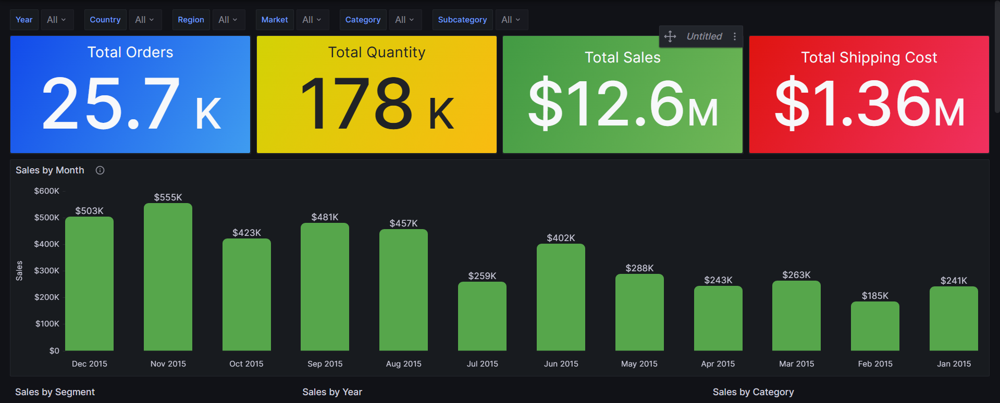

# 📊 Business KPI Dashboard – Grafana OSS + MySQL

A dynamic and visually rich business intelligence dashboard built using **Grafana OSS** and **MySQL**, focusing on **sales data analysis** through key performance indicators (KPIs), time series, category splits, and regional insights.

---

## 🧰 Stack Used

- 🖥️ **Grafana OSS** (Open Source edition)
- 🗄️ **MySQL** as data source
- 🔍 Custom SQL queries
- 🧱 Dashboard versioned via `.json` export
- 📷 Snapshots & screenshots for sharing

---

## 📌 Project Objective

To track and analyze **sales, orders, shipping costs, and quantity metrics** across:
- Time (monthly/yearly)
- Product categories
- Geographic regions
- Segments and customer data

This is ideal for learning open-source BI tools and how to connect SQL databases to Grafana for real-time analysis.

---

## 📁 Project Structure

| File | Description |
|------|-------------|
| `Business KPI-1753195091398.json` | Exported Grafana dashboard config file |
| `screenshots/1.PNG` | KPI Summary Panel |
| `screenshots/2.PNG` | Time Trends & Category Breakdown |
| `screenshots/3.PNG` | Regional Sales Overview |
| `screenshots/4.PNG` | Top Products & Customers |
| `README.md` | Project documentation |

---

## 📸 Dashboard Panels

- ✅ **Total Sales, Orders, Quantity, Shipping Cost** (Stat cards)
- 📈 **Monthly/Yearly Sales Trends**
- 🧩 **Segment & Category Distribution (Pie/Bar)**
- 🌍 **Top Regions by Sales**
- 🧑‍💼 **Top Customers & Products** (with table heatmaps)

All charts are created using **Grafana's panel editor** with SQL-backed data, dynamic filtering, and coloring.

---

## 🌐 Live Snapshot (Read-Only)
🔗 View Medium Article
[https://thelastdanc3.medium.com/building-a-business-kpi-dashboard-using-grafana-oss-mysql-7f22bad4f187](https://thelastdanc3.medium.com/building-a-business-kpi-dashboard-using-grafana-oss-mysql-7f22bad4f187)
🔗 View Grafana Snapshot:  
[https://snapshots.raintank.io/dashboard/snapshot/](https://snapshots.raintank.io/dashboard/snapshot/GGw1Du1rNzzmTQFjGmd9htqZi88aIMr9)

---

